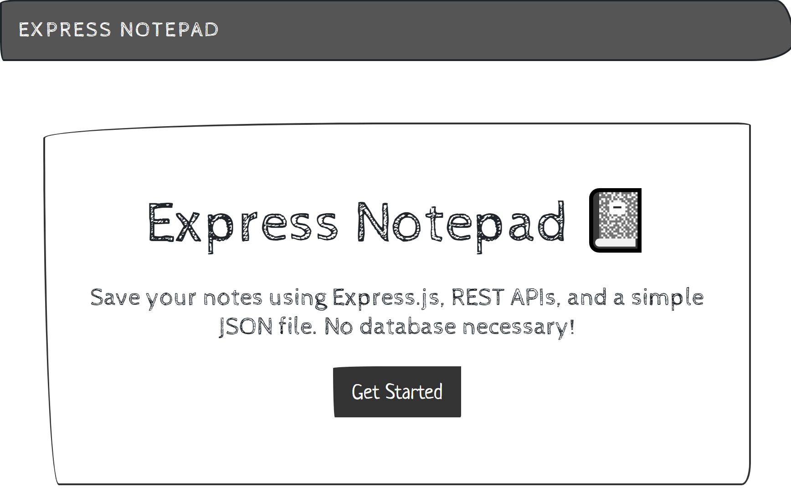

# Express Note Taker
 <b> Website:</b> &nbsp; [https://express-notepad-01132021.herokuapp.com/](https://express-notepad-01132021.herokuapp.com/)
 
  This is a simple note taking application which saves notes from a web page to a JSON file saved in a server side Node.js environment, running an Express web server. The client side of the application uses jQuery AJAX API calls to send and revieve the note content. 
  

 
  

  
  ## Table of Contents
  * [Installation](#Installation)
  * [Usage](#Usage)
  * [Website](#website)
  * [Contributing](#Contributing)
  * [License](#License)

  ## Installation
  Navigate to the root directory for this project in your terminal of choice, then install the required packages with npm install.

  ## Usage
  To run the application, after installing required packages, prompt will begin by typing node app in the root directory of this project.

## Website
 Deployed to Heroku: https://express-note-taker-01132020.herokuapp.com/

  ## Contributing
  Contributions are welcome. Submit a pull request or open an issue if you would like make improvements.

## License

MIT License

Copyright (c) 2020 Adam Lane

Permission is hereby granted, free of charge, to any person obtaining a copy of this software and associated documentation files (the "Software"), to deal in the Software without restriction, including without limitation the rights to use, copy, modify, merge, publish, distribute, sublicense, and/or sell copies of the Software, and to permit persons to whom the Software is furnished to do so, subject to the following conditions:

The above copyright notice and this permission notice shall be included in all copies or substantial portions of the Software.

THE SOFTWARE IS PROVIDED "AS IS", WITHOUT WARRANTY OF ANY KIND, EXPRESS OR IMPLIED, INCLUDING BUT NOT LIMITED TO THE WARRANTIES OF MERCHANTABILITY, FITNESS FOR A PARTICULAR PURPOSE AND NONINFRINGEMENT. IN NO EVENT SHALL THE AUTHORS OR COPYRIGHT HOLDERS BE LIABLE FOR ANY CLAIM, DAMAGES OR OTHER LIABILITY, WHETHER IN AN ACTION OF CONTRACT, TORT OR OTHERWISE, ARISING FROM, OUT OF OR IN CONNECTION WITH THE SOFTWARE OR THE USE OR OTHER DEALINGS IN THE SOFTWARE.
